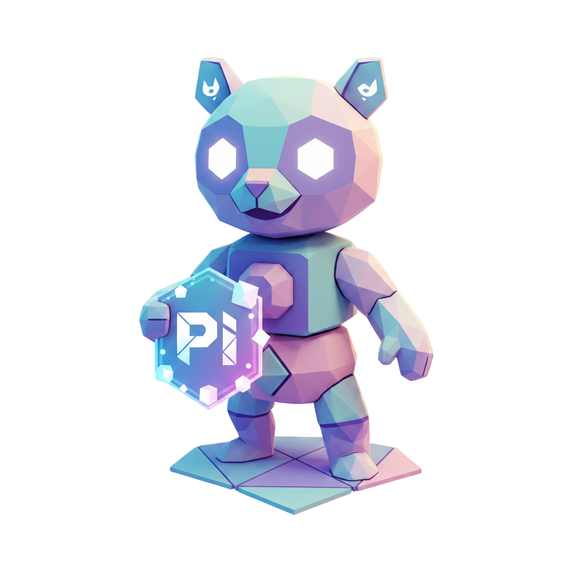

<div align="center"\>


 
# Flutter Polyicon

## **The Zero-Config Icon Font Generator for Flutter**

***Turn your SVGs into a sleek, type-safe icon font in seconds.***

[](https://pub.dev/packages/flutter_polyicon)
[](https://opensource.org/licenses/MIT)
</div>

-----

## ✨ Why Flutter Polyicon?

| Feature | Description |
| :--- | :--- |
| **🚀 Zero Config** | Works out of the box with sensible defaults. Get started instantly. |
| **⚡ Blazing Fast** | Font-based icons are vector-scalable, lightweight, and render quickly. |
| **🎨 Designer Friendly** | Simply drop in any standard SVG export. No manual path editing. |
| **🔒 Offline First** | The tool runs locally. No external services or API keys are required. |
| **✍️ Type-Safe** | Generates a Dart class, providing compile-time safety and auto-completion. |

-----

## 🚀 Quick Start Guide

### 1\. Install Globally

Activate the tool using the Dart package manager.

```bash
dart pub global activate flutter_polyicon
```

### 2\. Initialize Project

Run the `init` command to set up the necessary files and directories.

```bash
flutter_polyicon init
```

> **Result:** This creates a default `flutter_polyicon.yaml` configuration file and the source SVG folder: `assets/icons/svg/`.

### 3\. Add SVGs & Generate

Place your SVG files into `assets/icons/svg/` and execute the `generate` command.

```bash
flutter_polyicon generate
```

> **Output:** You'll get the generated font file (`fonts/app_icons.ttf`) and a type-safe Dart class (`lib/icons/app_icons.dart`) ready to be imported.

-----

## 🛠️ Configuration (`flutter_polyicon.yaml`)

Customize the output paths and names to fit your project structure.

| Field | Description | Default |
| :--- | :--- | :--- |
| `name` | The font family name registered in `pubspec.yaml`. | `MyAppIcons` |
| `class_name` | The generated Dart class name (e.g., `MyIcons`). | PascalCase of `name` |
| `output.font_file` | Relative path for the generated `.ttf` font file. | `fonts/app_icons.ttf` |
| `output.dart_file` | Relative path for the generated Dart icon class. | `lib/icons/app_icons.dart` |
| `input.svg_dir` | Directory containing the source SVG files. | `assets/icons/svg` |

```yaml
name: MyAppIcons
class_name: MyIcons
output:
  font_file: fonts/app_icons.ttf
  dart_file: lib/icons/app_icons.dart
input:
  svg_dir: assets/icons/svg
```

-----

## 📱 Usage

After generation, import the Dart file and use the static icon constants like any other Flutter icon.

```dart
import 'package:your_app/icons/app_icons.dart';
import 'package:flutter/material.dart';

// ... Inside your Widget build method
Column(
  children: [
    // Basic usage (icon file named 'home.svg')
    Icon(MyIcons.home),

    // Custom size and color (icon file named 'settings.svg')
    Icon(
      MyIcons.settings, 
      size: 32.0, 
      color: Colors.deepPurple,
    ),

    // Icon file named 'user-profile.svg'
    Icon(MyIcons.user_profile), 
  ],
)
```

-----

## 💡 Advanced Options & CI/CD

| Option | Command | Description |
| :--- | :--- | :--- |
| **Recursive Scanning** | `flutter_polyicon generate --recursive` | Include SVG files found within subfolders of the input directory. |
| **Verbose Mode** | `flutter_polyicon generate --verbose` | Print detailed logs for debugging and understanding the generation process. |
| **CI/CD Integration** | (No extra flag needed) | The tool is designed to run non-interactively, making it perfect for integration into automated build processes (e.g., GitHub Actions, GitLab CI). |

-----

<div align="center"\>

## 🤝 Contributing

We welcome your ideas, bug reports, and code contributions\! Please review `CONTRIBUTING.md` before submitting a pull request.

<br />

***Made with ❤️ for the Flutter community.***

</div>